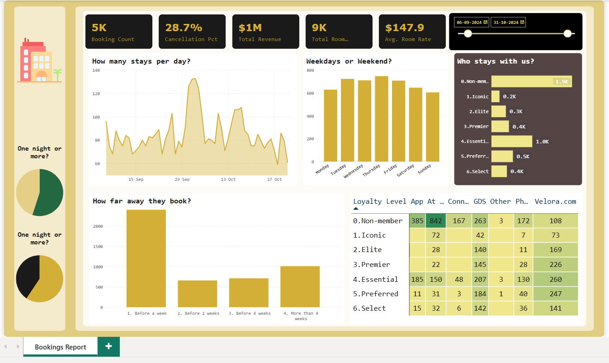

# 🏨 Hotel Booking Dashboard – Power BI

An interactive Power BI dashboard designed to analyze hotel booking data, providing insights into booking trends, customer demographics, and revenue metrics.

## 📌 Project Overview

This project offers a comprehensive analysis of hotel booking data, aiming to identify patterns and factors affecting hotel performance. The dashboard facilitates data-driven decision-making by visualizing key performance indicators and trends.

## 📊 Features

- **Booking Trends**: Visualization of booking patterns over time.
- **Customer Demographics**: Analysis of customer origins and types.
- **Revenue Metrics**: Insights into revenue generated from different booking channels.
- **Interactive Filters**: Dynamic slicers for customized data views.

## 🛠️ Tools & Technologies

- **Power BI Desktop**: For creating interactive visualizations.
- **Microsoft Excel**: Data preprocessing and management.

## 📁 Files in Repository

- `Hotel Booking Dashboard.pbix`: Main Power BI dashboard file.
- `Daashboard.png`: Screenshot of the dashboard.
- `powerbi_layout.png`: Layout design of the dashboard.
- `resort.png`: Image representing resort bookings.

## 📷 Screenshots

*Overview of hotel booking performance.*

*Design layout of the Power BI dashboard.*
